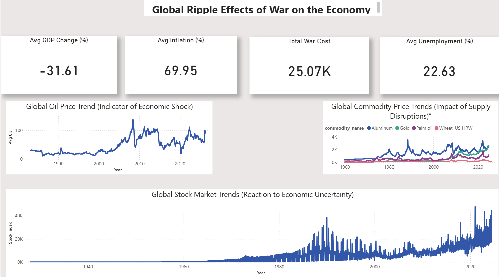
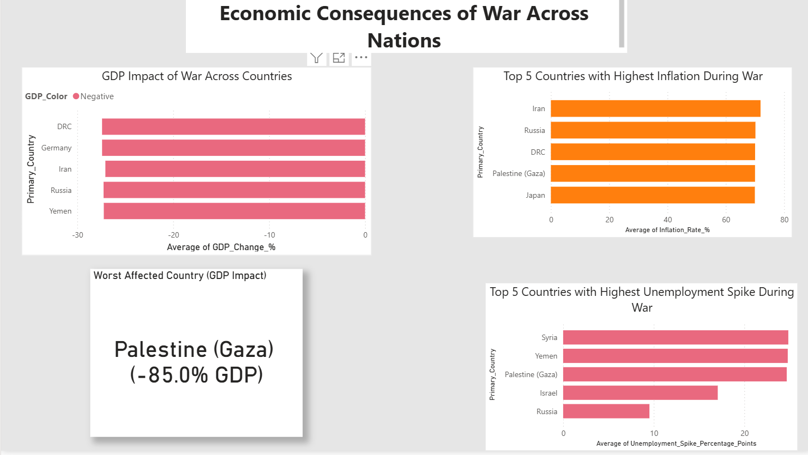
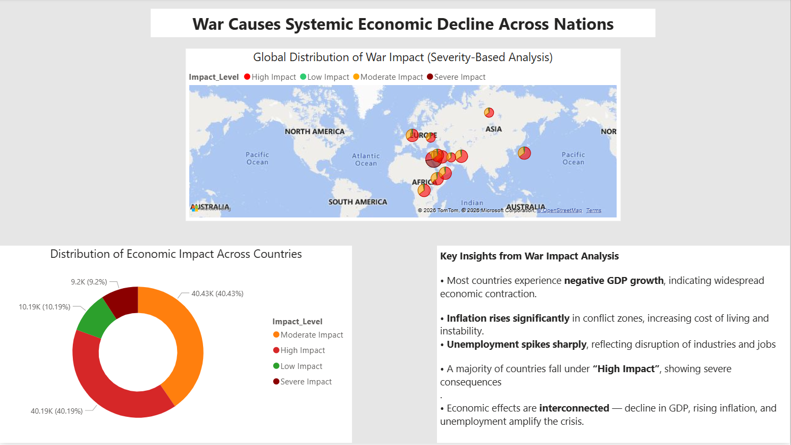

# 🌍 Global War Impact Analysis Dashboard
## 📸 Dashboard Preview

### 🔹 Overview Dashboard



### 🔹 Economic Indicators Analysis



### 🔹 Global Impact & Insights




## 🔍 Overview

This project analyzes the economic impact of war across countries using key macroeconomic indicators such as GDP change, inflation, unemployment, and global market trends.

---

## 🎯 Objective

To evaluate how war disrupts economic stability and identify patterns across countries and economic indicators.

---

## 🛠 Tools & Technologies

* Power BI
* Data Cleaning & Transformation
* Data Modeling
* Data Visualization

---

## 📈 Key Insights

* Most countries experience **negative GDP growth** during war
* Inflation increases due to **supply chain disruptions**
* Unemployment rises due to **economic instability**
* Economic indicators are **highly interconnected**
* Severe impact observed in highly conflict-affected regions

---

## 📊 Dashboard Features

* KPI-based summary of key metrics
* Multi-page dashboard for structured analysis
* Country-level comparison
* Global geographic visualization
* Impact severity classification

---

## 📁 Project Structure

```
dashboard/        → Power BI dashboard (.pbix)
presentation/     → Project presentation (.pptx)
data/             → (Not included due to size constraints)
README.md         → Project documentation
```

---

## 📁 Data Access

Due to large file sizes, datasets are not included in this repository.
They can be provided upon request.

---

## 🚀 Outcome

This project demonstrates how war creates widespread economic disruptions affecting growth, inflation, and employment across nations.

---

## 🔮 Future Improvements

* Integration of real-time data
* Predictive modeling for economic impact
* Case-specific war analysis

---

